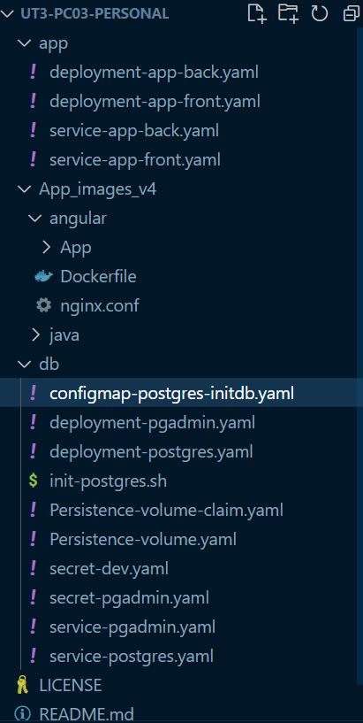

# Informe final

## Archivos y directorios finales

Para este proyecto hemos optado por esta estructura final. En este caso tenemos un fichero llamado init-postgres.sh el cual no se utiliza dentro de la practica debido a que contiene el script que encontramos dentro del fichero configmap-postgres-initdb.yaml



## Base de datos

Primero configuraremos todo lo referente a la base de datos y la pagina que utilizaremos para la gestión de esta a través de web por parte del administrador y el programador encargado de la aplicación java.

### Encriptación de la información

Dentro de nuestra configuración tenemos que generar unos ficheros secrets los cuales nos permitirán tener la información sensible de forma oculta/encriptada por lo que se protegeremos la información sensible en nuestro servidor de kubernetes. 

La información que encriptaremos será la de acceso a postgres y a la plataforma de pgadmin.

```yaml
---
secret-dev.yaml
---
apiVersion: v1
kind: Secret
metadata:
  name: secret-dev
  labels:
    app: postgres
type: Opaque
data:
  db: cG9zdGdyZXM= #postgres
  username: cG9zdGdyZXM= #postgres
  password: cXdlcnR5 #qwerty
```

```yaml
---
secret-postgres.yaml
---
apiVersion: v1
kind: Secret
metadata:
  name: secret-pgadmin
type: Opaque
data:
  username: a2FrYXJvdEBkcmFnb25iYWxsLmNvbQ== # kakarot@dragonball.com
  password: U3VwZXJTYWl5YW4z # SuperSaiyan3
```

### Persistencia

Para realizar la persistencia primero deberemos de crear los recursos que utilizaremos en kubernetes. Para poder crear esta generaremos un pv y pvc los cuales añadiremos posteriormente al deployment de postgres para crear la persistencia de este.

```yaml
apiVersion: v1
kind: PersistentVolume
metadata:
  name: bdd-pv
  labels:
    type: local
    app: postgres 
spec:
  capacity:
    storage: 5Gi
  accessModes:
    - ReadWriteMany
  storageClassName: manual
  hostPath:
    path: "/mnt/data/"
```

```yaml
apiVersion: v1
kind: PersistentVolumeClaim
metadata:
  name: bdd-pvc
  labels:
    app: postgres
spec:
  storageClassName: manual
  accessModes:
    - ReadWriteMany
  resources:
    requests:
      storage: 2Gi
```

### Configmap

Creamos el configmap el cual tendrá un script de inicialización que utilizaremos para crear el usuario de BDD que necesitamos para que la aplicación funcione.

```yaml
apiVersion: v1
kind: ConfigMap
metadata:
  name: postgres-config
  labels:
    app: postgres
data:
  postgres_db: billingapp_db
  postgres_init.sh: |-
    #!/bin/bash
    set -e
    psql -v ON_ERROR_STOP=1 --username "$POSTGRES_USER" --dbname "$POSTGRES_DB" <<-EOSQL
      CREATE USER billingapp WITH PASSWORD 'qwerty';
      CREATE DATABASE billingapp_db;
      GRANT ALL PRIVILEGES ON DATABASE billingapp_db TO billingapp;
    EOSQL 
```

### Deployments

Para la parte de pgadmin y postgres deberemos de realizar los deployments de las aplicaciones mencionadas, empezamos generando el deployment de pgadmin. En este deployment simplemente deberemos de establecer las variables de entorno que utilizaremos para el usuario y contraseña creados anteriormente en el secret.

```yaml
apiVersion: apps/v1
kind: Deployment
metadata:
  name: pgadmin-deployment
spec:
  selector:
    matchLabels:
      app: pgadmin
  replicas: 1
  template:
    metadata:
      labels:
        app: pgadmin
    spec:
      containers:
      - name: pgadmin
        image: dpage/pgadmin4
        ports:
        - name: pgadmin
          hostPort: 8080
          containerPort: 80
        env:
        - name: PGADMIN_DEFAULT_EMAIL
          valueFrom:
            secretKeyRef:
              name: secret-pgadmin
              key: username
        - name: PGADMIN_DEFAULT_PASSWORD
          valueFrom:
            secretKeyRef:
              name: secret-pgadmin
              key: password
        envFrom:
        - secretRef:
            name: secret-pgadmin
```

En el caso del deployment de postgres definimos los volúmenes que utilizaremos los cuales son el configmap creado anteriormente y el volumen persistente que utilizaremos para la persistencia de la base de datos.

```yaml
apiVersion: apps/v1
kind: Deployment
metadata:
  name: postgres
spec:
  replicas: 1
  selector:
    matchLabels:
      app: postgres
  template:
    metadata:
      labels:
        app: postgres
    spec:
      containers:
        - name: postgres
          image: postgres:latest
          imagePullPolicy: "IfNotPresent"
          envFrom:
            - secretRef:
                name: secret-dev
          volumeMounts:
            - mountPath: /var/lib/postgresql/data
              name: postgresql
            - mountPath: /docker-entrypoint-initdb.d
              name: init-script
      volumes:
        - name: postgresql
          persistentVolumeClaim:
            claimName: bdd-pvc
        - name: init-script
          configMap:
            name: postgres-config
```

### Servicios

Por ultimo lanzaremos los servicios que utilizaremos para tener acceso a estas aplicaciones.

```yaml
apiVersion: v1
kind: Service
metadata:
  name: pgadmin
spec:
  selector:
    app: pgadmin
  ports:
    - name: pgadmin
      port: 80
      targetPort: http
  type: ClusterIP
```

Sabiendo que posteriormente esta base de datos tendrá que tener conexión con un Docker que vamos a levantar establecemos el service como nodeport y establecemos los puertos necesarios y la IP para que se realicen la conexión. Este Docker contendrá una aplicación en java la cual nos dan para su despliegue.

```yaml
apiVersion: v1
kind: Service
metadata:
  name: postgres-service
  labels:
    app: postgres
spec:
  clusterIP: 10.96.1.2
  ipFamilies:
  - IPv4
  ports:
  - name: postgres
    port: 5432
    nodePort: 30432
  type: NodePort
  selector:
    app: postgres
```

## Aplicación Java

### Despliegue en docker

Para la aplicación de java primero deberemos de crear los dockers que utilizaremos para crear los deployments que utilizaremos. Estoy podemos hacerlo gracias a los ficheros dockerfile que vienen dentro de la carpeta App_images_v4 en su respectiva carpeta.

para ello usamos el siguiente comando.

```bash
docker build -t "nombre" .
```

tras crear el docker deberemos de crear un tag para que de esta forma kubernetes pueda "acceder" a nuestro docker interno detectar que esa imagen ya se encuentra instalada de forma local y añadirla a kubernetes.

```bash
docker tag nombre_imagen nombre_tag
```

Una vez tenemos estos pasos realizado en ambos dockers podemos empezar a trabajar en kubernetes

### Deployments

Establecemos ambos deployments de forma que seleccione la imagen que hemos creado anteriormente en docker.

```yaml
apiVersion: apps/v1
kind: Deployment
metadata:
  name: back-pps
spec:
  replicas: 3
  selector:
    matchLabels:
      app: back-pps
  template:
    metadata:
      labels:
        app: back-pps
    spec:
      containers:
      - name: back-pps
        image: doggymux/back-pps:2.1
        ports:
        - containerPort: 7080
          name: billingappbport
```

```yaml
apiVersion: apps/v1
kind: Deployment
metadata:
  name: frontend-deployment
spec:
  replicas: 1
  selector:
    matchLabels:
      app: frontend
  template:
    metadata:
      labels:
        app: frontend
    spec:
      containers:
      - name: frontend-container
        image: doggymux/front-pps:1
        ports:
        - containerPort: 80
          name: billingappfport

```

### Servicios App

Para finalizar establecemos los dos servicios que utilizaremos para dar acceso a los deployment que hemos visto anteriormente.  

```yaml
apiVersion: v1
kind: Service
metadata:
  name: service-back-pps
spec:
  selector:
    app: back-pps
  ports:
  - name: service-back-pps
    port: 7080
    nodePort: 30780
  type: NodePort
```

```yaml
apiVersion: v1
kind: Service
metadata:
  name: frontend-service
  labels:
    app: frontend
spec:
  selector:
    app: frontend
  ports:
  - name: service-front-pps
    port: 80
  type: NodePort

```

